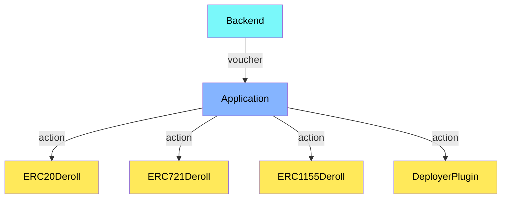
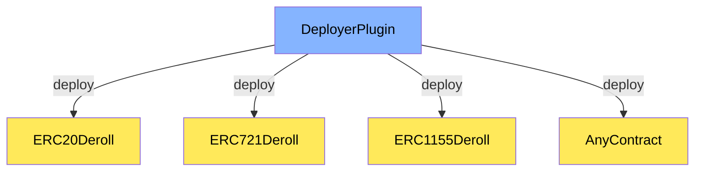
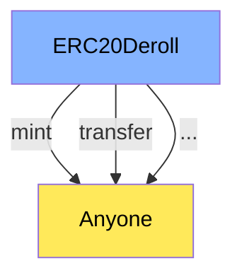
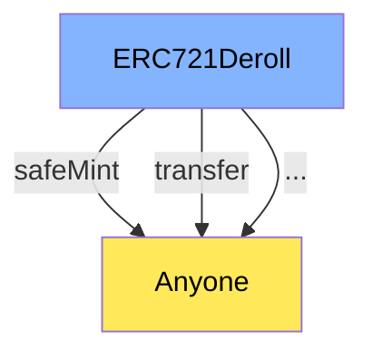
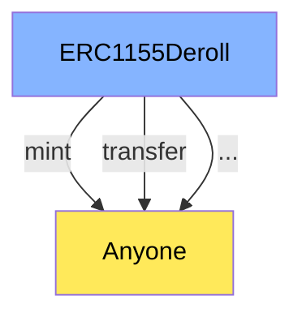

# Contracts

The contracts found here aim to onchain represent the assets and some actions that can be performed based on the logic contained within the backend of the Cartesi application through the voucher API when internally invoked.











```bash
make deploy
```

```bash
make test
```

```bash
make setup
```
