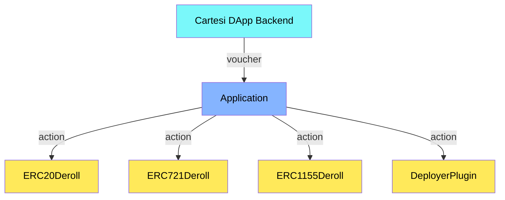

## Echo-Plus-Deroll Contracts


```mermaid
graph TD
    classDef core fill:#ffe95a,color:#000
    classDef master fill: #7AF8FA,color:#000
    classDef external fill:#85b4ff,color:#000

    ERC20Deroll:::core
    ERC721Deroll:::core
    ERC1155Deroll:::core
    DeployerPlugin:::core
    Application:::external
    Backend[Cartesi DApp Backend]:::master

    Backend -- voucher --> Application

    Application -- action --> ERC20Deroll
    Application -- action --> ERC721Deroll
    Application -- action --> ERC1155Deroll
    Application -- action --> DeployerPlugin
```

```bash
make deploy
```

```bash
make test
```

```bash
make env
```